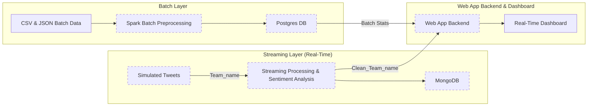

# Sportpulse Web App & API

## Problem Statement
Sports organizations, analysts, and fans often struggle to keep up with the massive flow of real-time data (tweets, stats, and updates) from football and NBA games.  
Existing tools usually focus either on historical analytics or live updates, but not both together in a unified, scalable platform.  
There is a need for a solution that combines **real-time sentiment analysis** with **batch historical insights** to provide a complete picture of team performance and fan perception.

---

## Solution
**Sportpulse** solves this by leveraging a **Lambda architecture** that integrates both real-time and batch data processing.  
- Real-time pipelines ingest and analyze team-related tweets to measure fan sentiment as games unfold.  
- Batch pipelines process historical data for long-term performance and trend analysis.  
- A web dashboard combines both, providing a single interface for **live updates**, **analytics**, and **insights**.

---

## Features
- **Real-time sentiment analysis** on football and NBA team tweets.
      used model:  [cointegrated/rubert-tiny Hugging Face model](https://huggingface.co/cointegrated/rubert-tiny-sentiment-balanced)
- **Batch processing** of historical team data for trend analysis.  
-  Data stored in **MongoDB** (real-time) and **Postgres** (batch).  
-  **Kafka-based streaming** pipeline for scalable event handling.  
-  **Interactive dashboard** with live updates and team insights.  
-  Pretrained sentiment model integrated with Spark for scalable analytics.  

---

## Overview
**Sportpulse** is a real-time and batch analytics platform for **Football and NBA** data. It leverages a **Lambda architecture** to provide:

- Real-time sentiment analysis on team tweets.
- Batch processing for historical data.
- Insights via a **web dashboard** with live updates.

---

## Architecture

The platform consists of three main layers:

### 1. Streaming Layer (Real-Time)
- Simulated team tweets sent to Kafka topics per team.
- Spark Streaming cleans data and performs sentiment analysis using a pretrained model.
- Results are stored in **MongoDB** and published to Kafka for the web app.
- NBA tweets dataset: [Kaggle NBA Tweets](https://www.kaggle.com/datasets/wjia26/nba-tweets/data)
- Football tweets dataset: [Kaggle EPL Tweets](https://www.kaggle.com/code/eliasdabbas/tweets-of-top-european-football-soccer-clubs)

### 2. Batch Layer
- Historical CSV/JSON data processed with Spark Batch.
- Results are stored in **Postgres** for analytics and reporting.
- NBA stats: [Google Drive Link](https://drive.google.com/file/d/1DQVO-gab-zRC9bGsy_vr12crctgtwCyl/view?usp=sharing)
- Football stats: [Google Drive Link](https://drive.google.com/drive/u/0/folders/1vkghI2vz0u7ID_ZbFdbFrkYwMMNg3sDE)

### 3. Serving Layer / Web App Backend
- Consumes Kafka streams via WebSockets.
- Fetches batch statistics from Postgres.
- Provides a **real-time dashboard** displaying sentiment and team analytics.

---

## Architecture Diagram



## Running Steps:

1. Build the modules using Docker:
 ```
docker-compose up
```

2. Install the API's requirements and run it:
```
cd api
python -m venv venv
.\venv\Scripts\activate
pip install -r requirements.txt
python app.py
```

3. Install the frontend packages and run it:
```
cd sportpulse-dashboard
npm i
npm start
```
 

